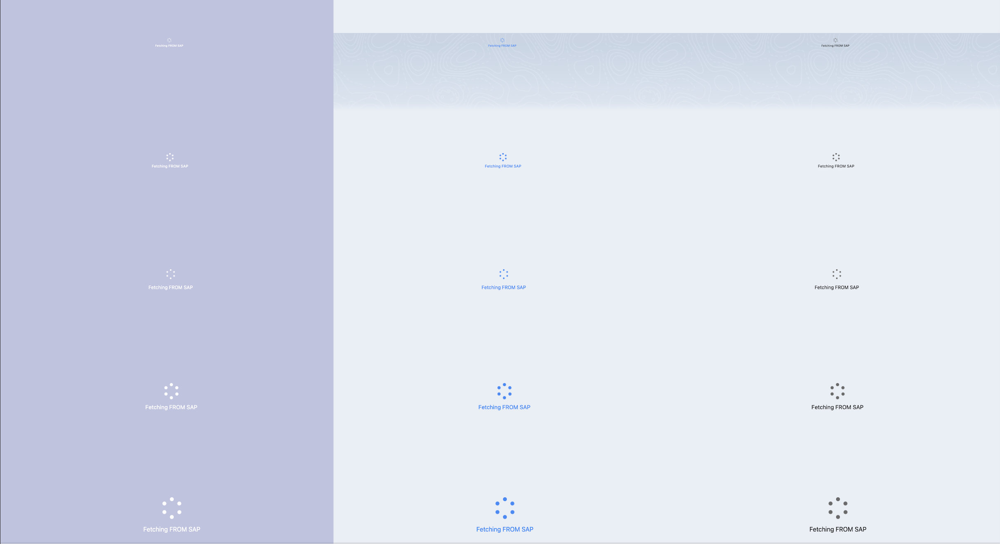

# Salesforce Dynamic Spinner

The contents of this project is largely inspired by this [blog post](https://bootcamp.uxdesign.cc/lightning-web-component-spinner-the-complete-guide-903b77c02e34) from Mario Pavicic.

I found that I have been reusing this component every time I need to display some text along with the spinner, and I thought, why not make it into a reusable component?



I have included a `parentComponent` lwc to illustrate how this component could be use as a child component across all your LWCs.
You would almost always want to wrap it in a container that has relative position, something like:

```html
    <div class="slds-is-relative" style="height: 300px;">
        <c-spinner variant="brand" text="Please wait."></c-spinner>
    </div>
```

And the inverse variant should be used only on dark backgrounds.

## Read more
- [Lightning Design System Spinner](https://www.lightningdesignsystem.com/components/spinners/)

